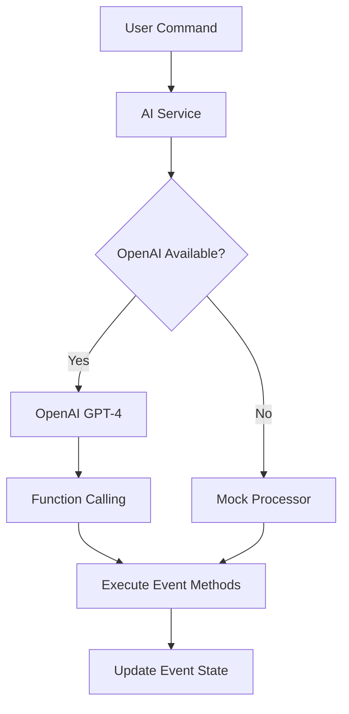

# AI Integration Documentation

## Overview

The AI Alpha prototype uses OpenAI's GPT-4 with function calling to provide controlled, secure AI-driven event creation. This document explains how the AI integration works and its enterprise-ready architecture.

## Architecture

### Core Components

1. **aiService.js** - Main AI service handling OpenAI integration
2. **aiManipulationRegistry.js** - Secure registry of AI-accessible methods
3. **Home.vue** - Vue component with event creation interface

### How It Works



## AI Function Calling

The system uses OpenAI's function calling feature to ensure the AI can only execute predefined, safe event management methods:

### Available Functions

```javascript
const functions = [
  {
    name: 'setEventName',
    description: 'Set the main event name',
    parameters: {
      type: 'object',
      properties: {
        name: { 
          type: 'string', 
          description: 'Event name (3-100 characters)' 
        }
      },
      required: ['name']
    }
  },
  {
    name: 'addTicketType',
    description: 'Add a ticket type with optional pricing',
    parameters: {
      type: 'object',
      properties: {
        name: { 
          type: 'string', 
          description: 'Ticket type name (2-50 characters)' 
        },
        price: { 
          type: 'number', 
          description: 'Ticket price (optional, must be positive)' 
        }
      },
      required: ['name']
    }
  }
  // ... other event functions
]
```

### Function Execution Flow

1. **User Command**: "Create a tech conference with professional and student tickets"
2. **AI Analysis**: GPT-4 understands intent and extracts parameters
3. **Function Call**: AI returns structured function calls for event creation
4. **Validation**: Parameters validated against schemas in the registry
5. **Execution**: `setEventName()`, `setEventDescription()`, `addTicketType()` methods called
6. **State Update**: Event configuration updates in real-time

## Security Features

### Controlled Execution
- ✅ AI can only call predefined event management functions
- ✅ No arbitrary code execution possible
- ✅ All parameters validated before execution
- ✅ Function schemas prevent invalid calls

### Error Handling
```javascript
try {
  const response = await openai.chat.completions.create({
    model: 'gpt-4',
    messages: [...],
    functions: availableFunctions,
    function_call: 'auto'
  })
  
  if (response.choices[0].message.function_call) {
    await executeFunctionCall(response.choices[0].message.function_call)
  }
} catch (error) {
  console.error('AI Error:', error)
  // Fallback to mock processor
  await mockProcessor(command)
}
```

### Fallback Strategy
- Primary: OpenAI GPT-4 with function calling
- Fallback: Local mock processor with pattern matching
## Configuration

### Environment Variables
```bash
# Required for real AI (optional)
VITE_OPENAI_API_KEY=sk-your-key-here

# AI Configuration
VITE_AI_MODEL=gpt-4           # Model to use
VITE_AI_TEMPERATURE=0.7       # Response creativity
VITE_AI_MODE=real            # 'real' or 'mock'
```

### API Key Setup
1. Visit https://platform.openai.com/api-keys
2. Create new API key
3. Add to `.env` file
4. Restart development server

## Enterprise Features

### Monitoring & Debugging
```javascript
// Successful AI processing
✅ OpenAI client initialized successfully
🤖 Processing command with real AI: Create a tech conference
🚀 Executing setEventName with args: { name: "Tech Innovation Conference" }

// Fallback mode
⚠️ OpenAI API key not configured. Using mock mode.
🔄 Using mock AI processor
```

### Visual Indicators
- 🟢 Green dot: Real AI active (OpenAI)
- 🟡 Yellow dot: Mock AI mode
- Command history shows processing mode
- Error messages in command history

### Performance Considerations
- Conversation history limited to 5 messages for cost control
- Temperature set to 0.7 for balanced creativity/consistency
- Function calling reduces token usage vs. text parsing
- Automatic fallback prevents service interruption

## Production Deployment

### Backend Proxy (Recommended)
```javascript
// Instead of browser-direct API calls, use backend proxy:
const response = await fetch('/api/ai/process', {
  method: 'POST',
  headers: { 'Content-Type': 'application/json' },
  body: JSON.stringify({ command, context })
})
```

### Security Best Practices
- ✅ Never expose API keys in frontend code
- ✅ Use backend proxy for API calls
- ✅ Implement user authentication and authorization
- ✅ Add comprehensive input sanitization
- ✅ Rate limit requests per user and session
- ✅ Log all AI interactions for audit compliance
- ✅ Monitor API usage and costs

### Scalability
- Horizontal scaling with backend API
- Database storage for conversation history
- Caching layer for common patterns
- Load balancing for high availability

---

*This integration demonstrates enterprise-ready AI-driven UI manipulation with security, fallbacks, and extensibility built-in.*
