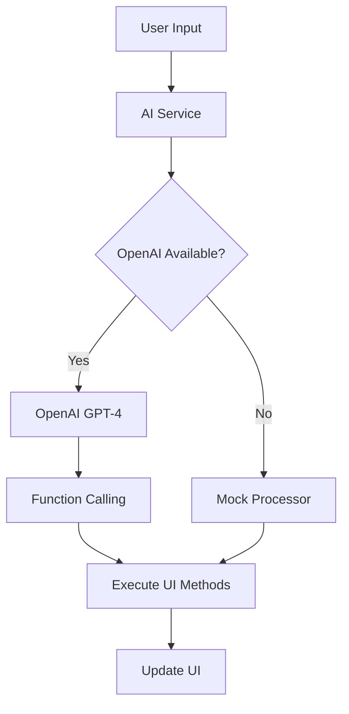

# AI Integration Documentation

## Overview

The AI Alpha prototype uses OpenAI's GPT-4 with function calling to provide controlled, secure AI-driven UI manipulation. This document explains how the AI integration works and how to extend it.

## Architecture

### Core Components

1. **aiService.js** - Main AI service handling OpenAI integration
2. **Home.vue** - Vue component with UI manipulation methods
3. **Function Definitions** - Structured definitions for AI function calling

### How It Works



## AI Function Calling

The system uses OpenAI's function calling feature to ensure the AI can only execute predefined, safe methods:

### Available Functions

```javascript
const functions = [
  {
    name: 'addButton',
    description: 'Add a button to the interface',
    parameters: {
      type: 'object',
      properties: {
        text: { type: 'string', description: 'Button text' },
        style: {
          type: 'object',
          properties: {
            color: { 
              type: 'string', 
              enum: ['purple', 'blue', 'green', 'red', 'gold', 'magic'] 
            }
          }
        }
      },
      required: ['text']
    }
  },
  // ... other functions
]
```

### Function Execution Flow

1. **User Command**: "Create a purple button that says 'Cast Spell'"
2. **AI Analysis**: GPT-4 understands intent and parameters
3. **Function Call**: AI returns structured function call
4. **Validation**: Parameters validated against schema
5. **Execution**: `addButton('Cast Spell', id, { color: 'purple' })`
6. **UI Update**: Button appears in interface

## Security Features

### Controlled Execution
- ✅ AI can only call predefined functions
- ✅ No arbitrary code execution possible
- ✅ All parameters validated before execution
- ✅ Function schemas prevent invalid calls

### Error Handling
```javascript
try {
  const response = await openai.chat.completions.create({
    model: 'gpt-4',
    messages: [...],
    functions: availableFunctions,
    function_call: 'auto'
  })
  
  if (response.choices[0].message.function_call) {
    await executeFunctionCall(response.choices[0].message.function_call)
  }
} catch (error) {
  console.error('AI Error:', error)
  // Fallback to mock processor
  await mockProcessor(command)
}
```

### Fallback Strategy
- Primary: OpenAI GPT-4 with function calling
- Fallback: Local mock processor with pattern matching
- Graceful: No functionality loss if API unavailable

## Configuration

### Environment Variables
```bash
# Required for real AI (optional)
VITE_OPENAI_API_KEY=sk-your-key-here

# AI Configuration
VITE_AI_MODEL=gpt-4           # Model to use
VITE_AI_TEMPERATURE=0.7       # Response creativity
VITE_AI_MODE=real            # 'real' or 'mock'
```

### API Key Setup
1. Visit https://platform.openai.com/api-keys
2. Create new API key
3. Add to `.env` file
4. Restart development server

## Extending the System

### Adding New UI Functions

1. **Define Vue Method**:
```javascript
const addChart = (type, data, style = {}) => {
  elements.value.push({
    type: 'chart',
    chartType: type,
    data,
    style,
    id: Date.now()
  })
}
```

2. **Add Function Definition**:
```javascript
{
  name: 'addChart',
  description: 'Add a chart or graph to the interface',
  parameters: {
    type: 'object',
    properties: {
      type: {
        type: 'string',
        enum: ['bar', 'line', 'pie', 'scatter'],
        description: 'Type of chart to create'
      },
      data: {
        type: 'array',
        description: 'Chart data points'
      }
    },
    required: ['type', 'data']
  }
}
```

3. **Add Execution Case**:
```javascript
case 'addChart':
  uiMethods.addChart(parsedArgs.type, parsedArgs.data, parsedArgs.style || {})
  break
```

### AI Prompt Engineering

The system prompt guides AI behavior:

```javascript
const systemPrompt = `You are an AI assistant that helps users create and manipulate user interfaces through natural language commands. You can only execute predefined UI manipulation functions.

Available capabilities:
- Add interactive buttons with various colors and styles
- Create information cards with titles and content  
- Add counters for tracking progress or metrics
- Generate story elements (titles, paragraphs, characters)
- Change background themes and colors

When processing requests, choose appropriate colors, text, and styling that match the user's intent. For themed requests, use consistent visual elements.`
```

## Testing

### Manual Testing Commands
```bash
# Basic UI Elements
"Add a blue button that says Start Game"
"Create a counter for player score"
"Add a card with title Dashboard and content Welcome to the game"

# Story Generation  
"Create a space adventure story with alien encounters"
"Build a medieval fantasy tale with dragons and knights"

# Theme Changes
"Change to ocean theme with blue gradients"
"Set magical purple background with sparkles"

# Complex Scenarios
"Create a game interface with start button, score counter, and magical theme"
```

### Error Scenarios
```bash
# These should gracefully fallback to mock mode:
- Invalid API key
- Network connectivity issues  
- OpenAI API rate limits
- Malformed function calls
```

## Monitoring & Debugging

### Console Output
```javascript
// Successful AI processing
✅ OpenAI client initialized successfully
🤖 Processing command with real AI: Create a purple button
🚀 Executing addButton with args: { text: "Magic Button", style: { color: "purple" } }

// Fallback mode
⚠️ OpenAI API key not configured. Using mock mode.
🔄 Using mock AI processor
```

### Visual Indicators
- 🟢 Green dot: Real AI active (OpenAI)
- 🟡 Yellow dot: Mock AI mode
- Command history shows processing mode
- Error messages in command history

## Performance Considerations

### API Usage
- Conversation history limited to 10 messages
- Temperature set to 0.7 for balanced creativity/consistency
- Function calling reduces token usage vs. text parsing
- Automatic fallback prevents service interruption

### Caching Strategy
```javascript
// Future enhancement: cache common patterns
const responseCache = new Map()
const cacheKey = `${command.toLowerCase()}-${JSON.stringify(context)}`
```

### Rate Limiting
```javascript
// Future enhancement: implement rate limiting
const rateLimiter = {
  requests: 0,
  resetTime: Date.now() + 60000, // 1 minute
  maxRequests: 60
}
```

## Production Considerations

### Backend Proxy (Recommended)
```javascript
// Instead of browser-direct API calls, use backend proxy:
const response = await fetch('/api/ai/process', {
  method: 'POST',
  headers: { 'Content-Type': 'application/json' },
  body: JSON.stringify({ command, context })
})
```

### Security Best Practices
- ✅ Never expose API keys in frontend code
- ✅ Use backend proxy for API calls
- ✅ Implement user authentication
- ✅ Add input sanitization
- ✅ Rate limit requests per user
- ✅ Monitor API usage and costs

### Scalability
- Horizontal scaling with backend API
- Database storage for conversation history
- Caching layer for common patterns
- Load balancing for high availability

---

*This integration demonstrates enterprise-ready AI-driven UI manipulation with security, fallbacks, and extensibility built-in.*
